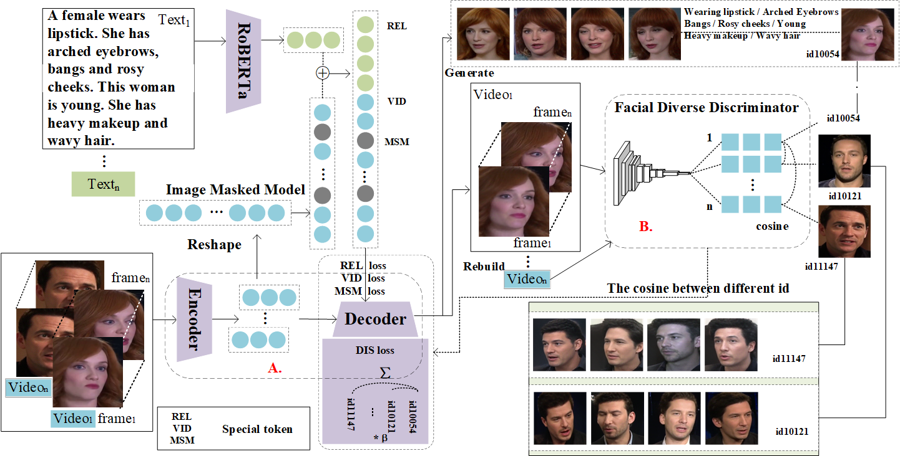
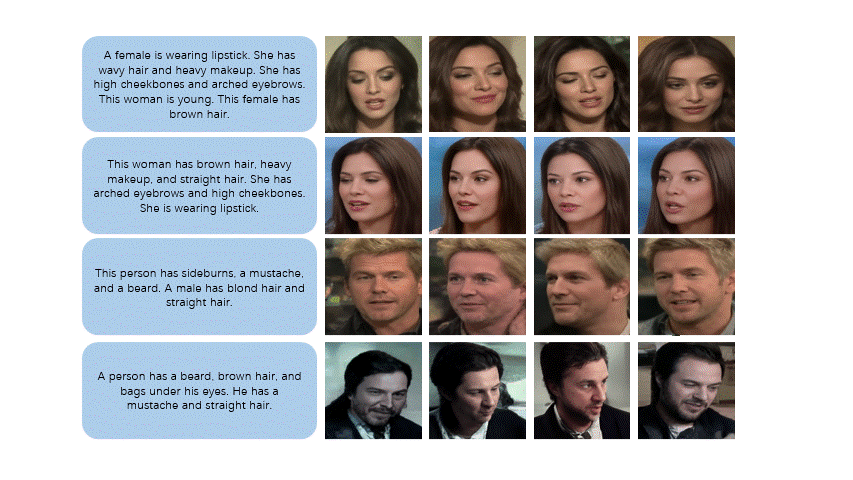

# (TYS)Tell Your Story: Text-Driven Face Video Synthesis With High Diversity via Adversarial Learning 

[paper](https://ieeexplore.ieee.org/document/10222631)

## Our pipeline

## Visual Results

## Model
link：https://pan.baidu.com/s/1IQv8b6M0ZlhlwhPjU7g4lQ 

code：gbpg 

## Acknowledgement
We have used codes from other great research work, including 
[MMVID](https://github.com/snap-research/MMVID), 
[StyleT2I](https://github.com/zhihengli-UR/StyleT2I),
[DeepFace](https://github.com/serengil/deepface), 
[VQGAN](https://github.com/CompVis/taming-transformers).

We sincerely thank these excellent work.
